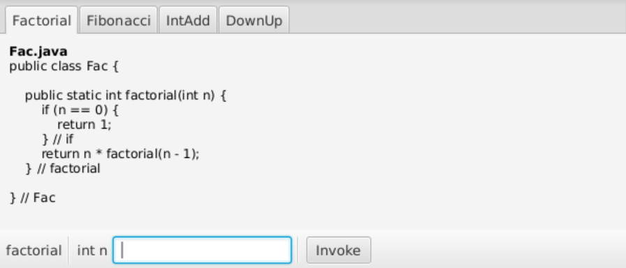

# cs1302-ce24 Recursive Problems


> "To understand recursion, you must understand recursion"

This class exercise explores the concept of [recursion](https://github.com/cs1302uga/cs1302-ce24).

## Course-Specific Learning Outcomes
* **LO2.c:** Use recursion to solve a non-trivial problem in a software solution.
* **LO5.b:** (Partial) Utilize a build tool such as Maven or Ant to create and manage a
complex software solution involving external dependencies.
* **LO7.c:** (Partial) Use common abstract data types and structures, including lists, queues, arrays,
and stacks in solving typical problems.

## References and Prerequisites

* [CSCI 1302 Recursion Tutorial](https://github.com/cs1302uga/cs1302-tutorials/blob/master/recursion.md)

## Questions

In your notes, clearly answer the following questions. These instructions assume that you are 
logged into the Nike server. 

**NOTE:** If a step requires you to enter in a command, please provide in your notes the full 
command that you typed to make the related action happen. If context is necessary (e.g., the 
command depends on your present working directory), then please note that context as well.

### Getting Started

1. Using Maven, create a project directory for this exercise called `cs1302-ce24` with a primary 
   package called `cs1302.ce24`.

1. Change into the `cs1302-ce24` directory that you just created using Maven, then do the
   following:
   
   1. Initialize a new Git repository:
      
      ```
      $ git init
      ```
      
   1. Create a [`.gitignore`](https://git-scm.com/docs/gitignore) (hidden file) with the following contents:
   
      ```
      bin/
      doc/
      target/
      *.class
      hs_err_pid*
      *~
      \#*\#
      core.*
      ```
      
      Add and commit the `.gitignore` file to the repository.
      
   1. Update the POM so that the project works with Java 8. After that, add and commit the `pom.xml` file to 
      the repository.
   
   1. Delete the Maven-generated driver (i.e., `src/main/java/cs1302/ce24/App.java`) and the unit test files 
      (i.e., everything under `src/test/java`). We won't add the `src` folder to the repository at this time
      because it only contains empty subdirectories. Git will not track empty directories.
   
## Exercise Steps

1. Create a `cs1302.ce24.Fac` class based on code below that provides a
   recursive [Factorial](https://mathworld.wolfram.com/Factorial.html) method. You may need to add
   a package statement and necessary imports.
   
   ```java
   /**
    * Factorial convenience class.
    */
   public class Fac {

       public static void main(String[] args) {
           System.out.println(factorial(3));
       } // main

       /**
        * Returns the Factorial of {@code n}.
        * @param n index
        * @return Factorial of {@code n}
        */
       public static int factorial(int n) {
           if (n == 0) {
               return 1;
           } // if
           return n * factorial(n - 1);
       } // fibonacci
    
   } // Fac
   ```
    
1. **Next, use Maven to compile and run the code.** Please use the `exec:java` phase to run.
   After you've confirmed that it compiles and runs, add and commit your `src` directory which
   now contains `Fac.java` in one of its subdirectories.
   
1. Please ensure you pass `checkstyle`, recommit if needed, **and tag as `checkpoint-1.1`**.

  


1. Let's consider the actual execution of `factorial(3)`. The diagram below depicts how the 
   call stack changes immediately after each invocation and return of the recursive method 
   calls in an execution of `factorial(3)`. Here, we redraw the call stack after each 
   recusive call is added (pushed ↓) and removed (popped ↑) from the call stack during 
   execution. The stack frames include local variables and the return value (using `?` if unknown).

   
   
   
   
1. With the above diagram in mind, modify `Fac.java` to  print out the call stack when the
   `factorial` method reaches the base case. Replace the if-statement with the following,
   where the `INSERT ANSWER HERE` lines ares to be modified later:
   
   ```java
   if (n == 0) {
       //   i. INSERT ANSWER HERE
       //  ii. INSERT ANSWER HERE
       // iii. INSERT ANSWER HERE
       Thread.currentThread().dumpStack(); // print call stack
       return 1;
   } // if
   ```
   
1. **Next, use Maven to compile and run the code.** Please use the `exec:java` phase to run.
   The `dumpStack()` method manually throws an exception and prints a stack trace, which 
   is Java's way of showing you the call stack. Here is the expected output:
   
   ```
   java.lang.Exception: Stack trace
       at java.lang.Thread.dumpStack(Thread.java:1336)
       at cs1302.ce24.Fac.factorial(Fac.java:22)
       at cs1302.ce24.Fac.factorial(Fac.java:25)
       at cs1302.ce24.Fac.factorial(Fac.java:25)
       at cs1302.ce24.Fac.factorial(Fac.java:25)
       at cs1302.ce24.Fac.main(Fac.java:9)
       [...] Maven-related portion of the call stack.
   6
   ```
   
   Once your have observed the program output, please answer the following questions in the
   comments you pasted into your code:
   
   1. Based on the program output, does `dumpStack()` print frames in the order they are
      pushed onto the call stack or in the reverse order? Please write "in order" or "reverse order".
   
   1. There are 8 depictions (i.e., 1 -- 8) of the call stack in the diagrams provided 
      earlier for `factorial(3)`. Which depiction best matches up with the program output if
      the Maven-related output lines and the line of output containing `java.lang.Thread.dumpStack` 
      are ignored?
      
   1. In the diagrams provided earlier for `factorial(3)`, we labeled one frame as the
      "calling method". What is the name of the calling method based on the program
      output.
      
1. After you've included your answers in the code, save and commit your changes.
   
1. Please ensure you pass `checkstyle`, recommit if needed, **and tag as `checkpoint-1.2`**.
  
   

1. Make sure you are logged into Nike with X-forwarding enabled. If not, logout and log back in
   appropriately. 
   
1. Run the `CallStackApp` program to explore some call stacks using a GUI: 

   ```
   $ CallStackApp &
   ```
   
   
   
1. Add the following multi-line comment to the end of `Fac.java` (after the endinf curly brace for the class}, 
   then use it to fill in answers for the questions below.
   
   ```java
   /* CHECKPOINT 1.3
    *   i. INSERT ANSWER HERE
    *  ii. INSERT ANSWER HERE
    * iii. INSERT ANSWER HERE
    */
   ```
   
   1. Using `CallStackApp`, invoke the `factorial` method with `3` supplied for `n`. As you scroll to
      to the right, do the call stack depictions in the app line up with the diagram presented for 
      `factorial(3)` earler in this exercise?
      
   2. If you exclude the calling method (which is omitted in the output of `CallStackApp`), what is the
      maximum number of `factorial` frames that need to fit on the call stack at any point in time to
      compute `factorial(9)`? 
      
   3. Using `CallStackApp`, try to invoke the `factorial` method with `10` supplied for `n`. The program
      prevents you from doing that because the author imposed an arbitrary upper limit on the input
      parameter. In your own `Fac.java` file, comment out the line of code that calls `dumpStack()`,
      then try calling `factorial` with a large `n` value in an attempt to make the program crash 
      when run (e.g., `20000` or bigger).
      When the program crashes, it's because the call stack is 
      not big enough to support the maximum number of frames needed to perform the recursion. 
      **What is the name of the exception that crashed the program?** Hint: Although the exception name is
      at the beginning of the stack trace, Maven repeats the exception name towards the end of its output.

1. After you've included your answers in the code, save and commit your changes.
   
1. Please ensure you pass `checkstyle`, recommit if needed, **and tag as `checkpoint-1.3`**.
  
   

1. Create a `cs1302.ce24.Fib` class based on code below that provides a
   recursive [Fibonacci](http://mathworld.wolfram.com/FibonacciNumber.html) method. You may need to add
   a package statement and necessary imports.
   
   ```java
   /**
    * Fibonacci convenience class.
    */
   public class Fib {

       public static void main(String[] args) {
           System.out.println(fibonacci(5));
       } // main

       /**
        * Returns the Fibonacci number at index {@code n}.
        * @param n index
        * @return Fibonacci number at index {@code n}
        */
       public static int fibonacci(int n) {
           if ((n == 0) || (n == 1)) {
               return 1;
           } // if
           return fibonacci(n - 2) + fibonacci(n - 1);
       } // fibonacci
    
   } // Fib
   ```
    
1. **Next, use Maven to compile and run the code.** Please use the `exec:java` phase to run.
   After you've confirmed that it compiles and runs, add and commit your `src` directory which
   now contains `Fib.java` in one of its subdirectories.
   
1. Please ensure you pass `checkstyle`, recommit if needed, **and tag as `checkpoint-2.1`**.
  


1. The `fibonacci` method that we provided is interesting because each call to `fibonacci` 
   results in it calling itself twice with different parameters. Add the following multi-line 
   comment to the end of `Fib.java`, then use it to fill in answers for the questions below.
   
   ```java
   /* CHECKPOINT 2.1
    *   i. INSERT ANSWER HERE
    *  ii. INSERT ANSWER HERE
    * iii. INSERT ANSWER HERE
    *  iv. INSERT ANSWER HERE
    */
    ```
    
    1. Using `CallStackApp`, invoke the `fibonacci` method with `5` supplied for `n`. Scroll
       through the timeline and identify the first frame that is returned to but not immediately
       popped in the next step in the timeline. What is the name of that frame?
       
    1. Another way to visualize recursion is using a digram called a **recursion tree**. Here
       is the recursion tree for `fibonacci(5)`.
   
       
       
       <!--
       http://mshang.ca/syntree/?i=%5Bfibonacci(5)%20%5Bfibonacci(3)%20%5Bfibonacci(1)%5D%20%5Bfibonacci(2)%20%5Bfibonacci(0)%5D%20%5Bfibonacci(1)%5D%20%5D%5D%20%5Bfibonacci(4)%20%5Bfibonacci(2)%20%20%5Bfibonacci(0)%5D%20%5Bfibonacci(1)%5D%5D%20%5Bfibonacci(3)%20%5Bfibonacci(1)%5D%20%5Bfibonacci(2)%20%20%5Bfibonacci(0)%5D%20%5Bfibonacci(1)%5D%5D%5D%5D%20%5D
       -->
       
       This recursion tree shows all the frames that execute for `fibonacci(5)`, which may have
       been hard to see if you're only inspecting the call stack itself over time. Using the 
       call stack timeline generated by `CallStackApp` for part (i), traverse the tree. Whenever
       a frame is pushed (↓) onto the call stack, traverse downward toward the frame in the tree;
       likewise, whenever a frame is popped (↑) traverse upward back to its caller. How many times
       do you visit `fibonacci(5)` when performing your traversal (including the initial visit)?
    
    1. Hopefully you noticed that some work is repeated by different frames. In our visualizations,
       this occurs when two frames have the same name. Based on the recursion tree, what is the name
       of the first frame that repeats work (based on traversal order)?
       
    1. How many times are base cases executed during the recursion for `factorial(5)`?
    
1. After you've included your answers in the code, save and commit your changes.
   
1. Please ensure you pass `checkstyle`, recommit if needed, **and tag as `checkpoint-2.2`**.

   

1. Create a `cs1302.ce24.DownUp` class based on code provided in `CallStackApp`. You may need to add
   a package statement and necessary imports. 
   
1. Add a `main` method that calls `downUp("Dawgs")`.

1. **Next, use Maven to compile and run the code.** Please use the `exec:java` phase to run.

1. Based on the program output, document the `downUp` method using Javadoc so that other
   people who want to use the method will understand what it's supposed to do. Your description
   should not narrate the code; instead it should describe the output based on the method's 
   input. Feel free to use `CallStackApp` to rapidly try different inputs so that you can get
   a better idea of what the method is doing -- the final column in the timeline shows the
   overall output.
   
1. After you've finished documenting the code, add and commit your `src` directory which
   now contains `DownUp.java` in one of its subdirectories.
   
1. Please ensure you pass `checkstyle`, recommit if needed, **and tag as `checkpoint-3.1`**.

  

1. The `downUp` method that we provided is interesting because each call to `downUp`
   performs a `println` before and after its recursive call (i.e., in its recursive case). 
   Add the following multi-line comment to the end of `DownUp.java`, then use it to fill 
   in answers for the questions below.
   
   ```java
   /* CHECKPOINT 3.2
    *   i. INSERT ANSWER HERE
    *  ii. INSERT ANSWER HERE
    * iii. INSERT ANSWER HERE
    */
    ```

    1. Write a `boolean` expression using `str` that is `true` if, and only if `downUp` is in a **base case**.
    
    2. Write a `boolean` expression using `str` that is `true` if, and only if `downUp` is in a **recursive case**.
    
    3. If you exclude the calling method, what is the maximum number of `downUp` 
       frames that need to fit on the call stack at any point in time to execute
       `downUp("Dawgs")`? 

1. After you've included your answers in the code, save and commit your changes.
   
1. Please ensure you pass `checkstyle`, recommit if needed, **and tag as `checkpoint-3.2`**.

   

1. Create a `cs1302.ce24.SplitString` class with a `splitString` method matching the following
   signature:
   ```java
   /** 
    * Returns a list of tokens from {@code str} based on the delimiter 
    * {@code delim}.
    * @param str   input string
    * @param delim delimiter / separator
    * @return list of tokens
    */
   public static List<String> splitString(String str, String delim)
   ```
   where `List<E>` is [`java.util.List<E>`](https://docs.oracle.com/javase/8/docs/api/java/util/List.html),
   which has known impementations like [`ArrayList<E>`](https://docs.oracle.com/javase/8/docs/api/java/util/ArrayList.html)
   and [`LinkedList<E>`](https://docs.oracle.com/javase/8/docs/api/java/util/LinkedList.html).

1. Implement the `splitString` method using recursion (**no loops!**). The method should split the 
   specified string into tokens based off of the provided delimiter. Each token will be added to
   the returned `List<String>`.
   Here are a few examples:
   
   | Call                                           | Returned List                                 |
   |------------------------------------------------|-----------------------------------------------|
   |`splitString("Hello_1302_students!", "_")`      | `["Hello", "1302", "Students!"]`              |
   |`splitString("1234.1,12345,23213,12,1,1", ",")` | `["1234.1", "12345", "23213", "12", "1", "1"]`|
   |`splitString("GNU's not Unix", "'")`            | `["GNU", "s not Unix"]`                       |
   |`splitString("Recursion is fun!", "9")`         | `["Recursion is fun!"]`                       |
   
   <a id="recursion-tree" />Here is a recursion-like tree for `splitString("Hello_1302_students!", "_")` that you might find useful:
   
   
   
   <!--
   http://mshang.ca/syntree/?i=%5BsplitString(%22Hello_1302_students!%22%2C%22_%22)%20%5BsplitString(%221302_students!%22%2C%22_%22)%20%5BsplitString(%22students!%22%2C%22_%22)%20%0A%5BsplitString(%22%22%2C%22_%22)%20return%20new%20LinkedList%3C%3E()%5D%20%5Blist.add(0%2C%22students%22)%5D%5D%20list.add(0%2C%221302%22)%5D%20%5Blist.add(0%2C%22Hello%22)%5D
   //-->
   
   We say _recursion-like_ because this tree shows more than just recursive calls. It provides a big
   hint about the base case formulation, and it illustrates that some work needs to be done in the
   recursive case between the recursive call and the return statement.
   
1. Add a `main` method to execute your `splitString` method with various input strings to verify that 
   it works properly. At the very least, please check it with the examples above. You may find the
   following method useful to include for testing purposes:
   ```
   public static void printList(List<String> list) {
       String output = list.stream().collect(Collectors.joining("\", \"", "[\"", "\"]"));
       System.out.println(output);
   } // printList
   ```
   where `Collectors` is [`java.util.stream.Collectors`](https://docs.oracle.com/javase/8/docs/api/java/util/stream/Collectors.html).

1. After you've confirmed that your `splitString` method works correctly, add and commit your `src` 
   directory which now contains `SplitString.java` in one of its subdirectories.
   
1. Please ensure you pass `checkstyle`, recommit if needed, **and tag as `checkpoint-4`**.
   


**Each student needs to individually submit their own work.**

1. Create a plain text file called `SUBMISSION.md` directly inside this exercise
   directory with the following information:

   1. Your name and UGA ID number;
   1. Collaborator names, if any; and
   1. The weekly code (listed with the exercise on eLC).
   
   Here is an example:
   
   ```
   1. Sally Smith (811-000-999)
   2. Collaborators: Joe Allen, Stacie Mack
   3. Weekly Code: replace-with-actual-code
   ```

1. Add and commit `SUBMISSION.md`. Also, do a final check to ensure your code 
   passes the `checkstyle` audit, then stage and commit all changes, if needed.

1. Change into the parent directory and use the `submit` command to submit this exercise to `cs1302a`:
   
   ```
   $ submit cs1302-ce24 cs1302a
   ```
   


<hr/>

[](http://creativecommons.org/licenses/by-nc-nd/4.0/)

<small>
Copyright &copy; Michael E. Cotterell, Brad Barnes, and the University of Georgia.
This work is licensed under a <a rel="license" href="http://creativecommons.org/licenses/by-nc-nd/4.0/">Creative Commons Attribution-NonCommercial-NoDerivatives 4.0 International License</a> to students and the public.
The content and opinions expressed on this Web page do not necessarily reflect the views of nor are they endorsed by the University of Georgia or the University System of Georgia.
</small>
